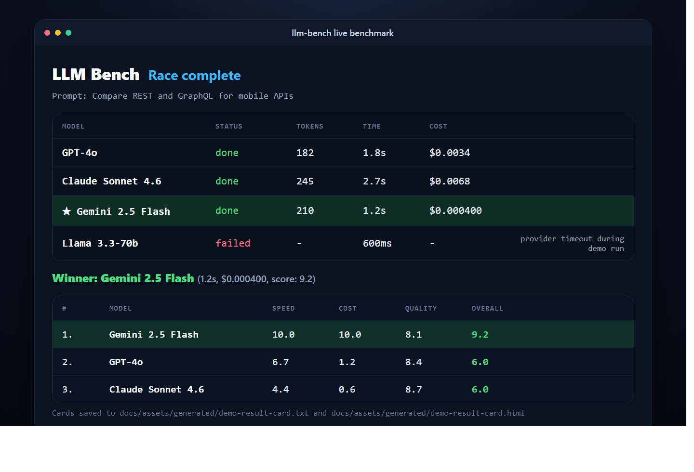
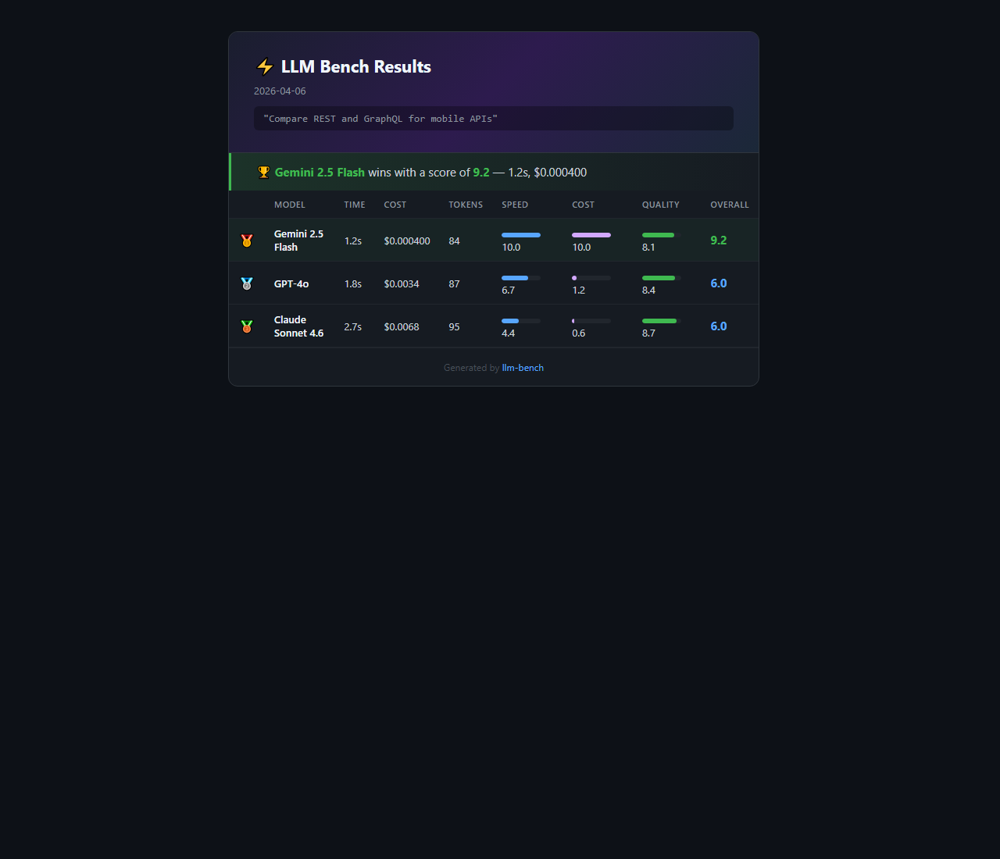

# llm-bench

`llm-bench` is a terminal CLI for benchmarking large language model APIs side by side. It runs multiple providers in parallel, streams live progress in the terminal, ranks the successful responses, and generates shareable result cards.

If you need a lightweight way to compare OpenAI, Anthropic, Gemini, and Groq models for latency, price, and response quality, this project is built for that workflow.

## Product Preview

### Live terminal race



### Shareable result card



## What This Product Actually Does

At runtime, `llm-bench`:

1. Accepts a prompt from the command line.
2. Selects the configured providers whose API keys are available.
3. Sends the same prompt, and optional system prompt, to each provider in parallel.
4. Streams live status, token estimates, elapsed time, and cost estimates in an Ink-based terminal UI.
5. Scores every successful response using a built-in heuristic for speed, cost, and response quality.
6. Ranks the successful models from best overall score to lowest.
7. Writes two report artifacts to disk.

## What It Creates

Every successful benchmark run creates:

- A live terminal race dashboard while providers are running.
- A ranked benchmark result for the current session.
- A plain text summary card, by default `result-card.txt`.
- A styled HTML summary card, by default `result-card.html`.

When you pass `--output ./results/my-run`, the tool creates:

- `./results/my-run.txt`
- `./results/my-run.html`

If the parent directory does not exist, `llm-bench` creates it automatically.

## What It Does Not Do

`llm-bench` is intentionally focused. It does not currently:

- Store benchmark history across runs.
- Produce JSON or CSV output.
- Use an LLM judge or human review for quality scoring.
- Pull live pricing from provider APIs.

If all selected providers fail, the run exits with a non-zero status instead of reporting a false success.

## Core Features

- Parallel provider execution for fast comparisons.
- Real-time terminal UI built with Ink and React.
- Provider-level failure handling so one failed model does not stop an otherwise successful run.
- Cross-provider system prompt support.
- Automatic result card generation in text and HTML formats.
- Config file support via `llm-bench.config.json`.
- Selectable model filters for supported provider slugs.

## Supported Providers and Model Slugs

These are the recommended model slugs for `--models`:

| Provider | Display Name | CLI Slug | Environment Variable |
| --- | --- | --- | --- |
| OpenAI | GPT-4o | `gpt-4o` | `OPENAI_API_KEY` |
| Anthropic | Claude Sonnet 4.6 | `claude-sonnet-4-6` | `ANTHROPIC_API_KEY` |
| Google | Gemini 2.5 Flash | `gemini-2.5-flash` | `GOOGLE_API_KEY` |
| Groq | Llama 3.3-70b | `llama-3.3-70b` | `GROQ_API_KEY` |

Notes:

- The Groq integration uses `llama-3.3-70b-versatile` internally, but the CLI accepts `llama-3.3-70b`.
- Provider display names also work as filters, but the slugs above are the recommended inputs.

## How Benchmarking Works

### 1. Provider Selection

The CLI starts with all built-in providers, then filters them by:

- `--models` if provided
- `llm-bench.config.json` defaults if present
- Available API keys in the environment

Providers without API keys are skipped with a warning.

### 2. Prompt Dispatch

Each selected provider receives:

- The same user prompt
- The same optional system prompt

Provider-specific implementations map the system prompt into the native API shape:

- OpenAI and Groq use system messages.
- Anthropic uses the `system` field.
- Gemini uses `systemInstruction`.

### 3. Live Updates

During streaming, the terminal UI updates:

- Provider status
- Estimated output token count
- Elapsed time
- Estimated USD cost

Live token counts are estimated from streamed text, not from callback count, which makes the live display less sensitive to SDK chunking behavior.

### 4. Final Scoring

After at least one provider finishes successfully, results are scored across:

- Speed: 30%
- Cost: 30%
- Quality heuristic: 40%

If every provider fails, the run fails instead of returning an empty result set.

### 5. Artifact Generation

On successful completion, `llm-bench` writes:

- A text result card
- An HTML result card

If card generation fails, the process exits non-zero.

## Installation

### Global install

```bash
npm install -g llm-bench
```

### Install from source

```bash
git clone https://github.com/BuildWithAbid/llm-bench.git
cd llm-bench
npm install
npm run build
```

## Environment Setup

Set one or more provider API keys before running the CLI.

### Bash or Zsh

```bash
export OPENAI_API_KEY="sk-..."
export ANTHROPIC_API_KEY="sk-ant-..."
export GOOGLE_API_KEY="AIza..."
export GROQ_API_KEY="gsk_..."
```

### PowerShell

```powershell
$env:OPENAI_API_KEY = "sk-..."
$env:ANTHROPIC_API_KEY = "sk-ant-..."
$env:GOOGLE_API_KEY = "AIza..."
$env:GROQ_API_KEY = "gsk_..."
```

## Quick Start

Run all available providers:

```bash
llm-bench run "Explain vector databases in simple terms"
```

Run only specific models:

```bash
llm-bench run "Write a Redis caching strategy for an API" --models gpt-4o,claude-sonnet-4-6,llama-3.3-70b
```

Add a system prompt:

```bash
llm-bench run "Explain Docker Compose" --system "Respond like a senior DevOps engineer. Be concise and practical."
```

Write output to a custom directory:

```bash
llm-bench run "Compare REST and GraphQL for mobile apps" --output ./results/api-comparison
```

## CLI Reference

### Command

```text
llm-bench run <prompt> [options]
```

### Arguments

| Argument | Description |
| --- | --- |
| `prompt` | The prompt sent to each selected provider |

### Options

| Option | Description |
| --- | --- |
| `-m, --models <models>` | Comma-separated list of models to race |
| `-s, --system <prompt>` | Optional system prompt |
| `-o, --output <path>` | Base path for `.txt` and `.html` result cards |
| `-c, --config <path>` | Optional path to a config file |
| `-V, --version` | Print the installed version |
| `-h, --help` | Show help |

### Examples

```bash
llm-bench run "Summarize event-driven architecture"
llm-bench run "Explain rate limiting" --models gemini-2.5-flash,gpt-4o
llm-bench run "Explain CQRS" --system "Answer for a staff engineer audience."
llm-bench run "Compare SQL and NoSQL" --output ./benchmarks/sql-nosql
llm-bench run "What is recursion?" --config ./llm-bench.config.json
```

For a dedicated command guide, see [docs/cli-reference.md](./docs/cli-reference.md).

## Configuration

By default, `llm-bench` looks for `llm-bench.config.json` in the current working directory. You can also pass a custom file path with `--config`.

Example:

```json
{
  "models": ["gpt-4o", "claude-sonnet-4-6", "gemini-2.5-flash"],
  "systemPrompt": "Be concise and direct. Use short paragraphs."
}
```

### Supported config fields

| Field | Type | Description |
| --- | --- | --- |
| `models` | `string[]` | Default model filters |
| `systemPrompt` | `string` | Default system prompt |

CLI flags override config values.

## Scoring Methodology

`llm-bench` does not claim to produce a rigorous research-grade evaluation. It uses a simple built-in heuristic so you can compare providers quickly without running a second judge model.

### Speed score

The fastest successful model gets `10`. Other models are scaled proportionally.

```text
speedScore = (fastestTime / modelTime) * 10
```

### Cost score

The cheapest successful model gets `10`. Other models are scaled proportionally.

```text
costScore = (cheapestCost / modelCost) * 10
```

### Quality score

Quality is estimated from two signals:

- Response length contributes 40%.
- Keyword overlap with the prompt contributes 60%.

The implementation extracts prompt words longer than 3 characters, then checks whether those words appear in the response.

### Overall score

```text
overallScore = (speed * 0.3) + (cost * 0.3) + (quality * 0.4)
```

## Output Artifacts

### Text card

The text card is intended for:

- Terminal logs
- Team chat
- Issue comments
- Plain text reports

Default output file:

```text
result-card.txt
```

### HTML card

The HTML card is intended for:

- Screenshotting benchmark results
- Sharing results internally
- Embedding a simple benchmark summary in documentation

Default output file:

```text
result-card.html
```

## Failure Behavior and Exit Codes

`llm-bench` handles failures at two levels.

### Provider-level failures

If one provider fails but at least one other provider succeeds:

- The failed provider is marked as failed in the UI.
- Successful providers are still scored.
- Result cards are still generated from the successful providers.

### Run-level failures

The process exits with code `1` when:

- No selected providers are available because API keys are missing.
- Every selected provider fails.
- Result card generation fails after a run.

The process exits with code `0` when:

- At least one provider finishes successfully and the cards are written successfully.

## Architecture Overview

The implementation is intentionally simple:

- `src/cli.ts`: parses arguments, loads config, filters providers, starts the UI
- `src/ui.tsx`: renders the live terminal experience and coordinates final output writing
- `src/runner.ts`: runs providers in parallel and aggregates results
- `src/scoring.ts`: computes speed, cost, quality, and overall scores
- `src/card.ts`: generates and writes text and HTML result cards
- `src/providers/*`: provider-specific streaming integrations
- `src/tokens.ts`: shared token estimation helpers used for live display and fallbacks

For a deeper breakdown, see [docs/architecture.md](./docs/architecture.md).

## Development

### Prerequisites

- Node.js 18+
- npm
- At least one provider API key for live testing

### Start in development mode

```bash
npm run dev -- run "Explain retrieval-augmented generation"
```

### Build

```bash
npm run build
```

### Test

```bash
npm test
```

### Regenerate preview assets

```bash
npm run docs:assets
```

Current automated tests cover:

- Total benchmark failure behavior
- Live token estimation behavior
- Nested output directory creation

## Extending the Project

To add a new provider:

1. Create a new file under `src/providers/`.
2. Implement the `LLMProvider` interface.
3. Return `text`, `inputTokens`, and `outputTokens`.
4. Add the provider to `ALL_PROVIDERS` in `src/cli.ts`.

When adding a provider, keep the following in mind:

- System prompt handling should use the provider's native API shape.
- Live streaming should call `onToken` with text chunks as they arrive.
- Token usage should use provider-native usage fields when available.
- Cost values are hard-coded in the provider definition and should be reviewed when pricing changes.

## Use Cases

This project is a good fit for:

- Comparing LLM API latency before shipping a feature
- Estimating the cost tradeoff between providers
- Running quick model bake-offs during development
- Creating lightweight benchmark artifacts for internal teams
- Testing how prompt changes behave across providers

## Limitations

To keep expectations aligned with the current implementation:

- Quality scoring is heuristic, not semantic evaluation.
- Pricing is static in source code, not fetched from provider pricing pages.
- Only built-in providers are benchmarked unless you extend the code.
- There is no persistent benchmark history or database.

## Documentation Index

- [README](./README.md)
- [Landing Page Docs](./docs/landing-page.md)
- [CLI Reference](./docs/cli-reference.md)
- [Architecture Guide](./docs/architecture.md)

## License

MIT
