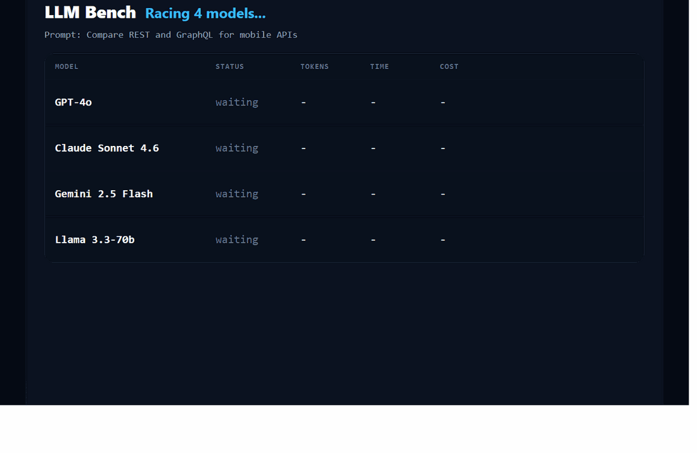

# LLM Benchmark CLI

Compare GPT-4o, Claude, Gemini, and Llama side by side from your terminal.

`llm-bench` is a lightweight LLM benchmark CLI for engineers who want a fast answer to practical questions:

- Which model is fastest for this prompt?
- Which provider is cheapest for this workload?
- Which response looks strongest without building a full evaluation stack?

## Product Preview

### Live terminal benchmark



### Shareable result card


## Why Teams Use llm-bench

### Compare providers in one command

Send the same prompt to multiple providers in parallel and watch the race live.

### Make cost and speed tradeoffs visible

The terminal UI surfaces token estimates, elapsed time, and cost estimates while responses are streaming.

### Create artifacts you can actually share

Each successful run generates:

- `result-card.txt`
- `result-card.html`

These outputs are useful for internal reviews, issue threads, and quick benchmark snapshots.

## What It Solves

Many teams evaluate models manually:

- Open one playground
- Paste a prompt
- Copy the answer
- Switch tabs
- Repeat for every provider
- Compare results by memory

`llm-bench` compresses that into a single terminal workflow with consistent prompt input, shared system prompts, and automatic ranking.

## Built For

- AI engineers comparing model APIs
- Developers testing prompt behavior across providers
- Product teams reviewing tradeoffs before rollout
- Internal platform teams creating lightweight benchmark evidence

## Benchmark Workflow

1. Choose one or more providers by API key and model slug.
2. Run a prompt with optional system instructions.
3. Watch the live terminal race.
4. Review the ranked results.
5. Share the generated result card.

## Supported Providers

| Provider | CLI Slug |
| --- | --- |
| OpenAI | `gpt-4o` |
| Anthropic | `claude-sonnet-4-6` |
| Google | `gemini-2.5-flash` |
| Groq | `llama-3.3-70b` |

## Example Commands

```bash
llm-bench run "Explain vector search for a backend engineer"
```

```bash
llm-bench run "Compare REST and GraphQL for mobile apps" --models gpt-4o,gemini-2.5-flash,llama-3.3-70b
```

```bash
llm-bench run "Explain Docker Compose" --system "Be concise and practical." --output ./results/docker-compose
```

## Documentation

- [Main README](../README.md)
- [CLI Reference](./cli-reference.md)
- [Architecture Guide](./architecture.md)
